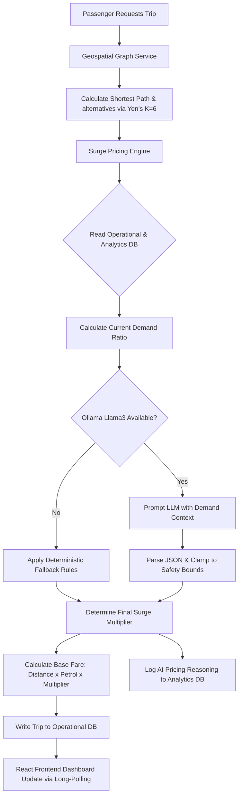

# SmartRide 🚗💨 — AI-Driven Ride-Sharing & Algorithmic Routing

[](https://opensource.org/licenses/MIT)
[](https://nodejs.org/)
[](https://react.dev/)
[](https://ollama.com/)

SmartRide is a next-generation carpooling and dynamic routing simulation platform that optimizes urban transportation through graph theory and localized generative AI. Moving beyond standard CRUD designs, SmartRide embeds real-time supply-demand heuristics, LLM-based surge pricing analysis, and multi-route pathfinding to create a robust, production-ready ecosystem for passengers and drivers.

---

## ⚡ Core Technical USPs

1. **Local LLM Surge Pricing (Primary AI)**
   * Utilizes a localized LLM (`llama3` via Ollama) to compute context-aware surge multipliers and discounts instead of using static time-based rules.
   * Prompts are optimized to parse real-time demand metrics into structured JSON outputs including mathematical recommendations and natural language justifications.

2. **Dijkstra & Yen's K-Shortest Paths (K=6)**
   * Resolves the "single shortest path" limitation in standard apps. The engine computes up to 6 non-cyclic, distinct routing alternatives to allow matching multiple carpool passengers traveling in the same general corridor.

3. **K-Nearest Neighbors (KNN) Graph Pruning**
   * Maps geospatial relationships among 35 nodes. The network establishes edges only with the **6 nearest geographic neighbors** for each node, creating a sparse graph that reduces computational pathfinding overhead while retaining 99% route accuracy.

4. **Resilient Failover Architecture**
   * Features a hybrid AI-heuristic fallback model. If the local Ollama daemon is offline or experiencing high latency, a rule-based deterministic surge calculator seamlessly intercepts requests to maintain 100% platform uptime.

5. **Dual-Database Design**
   * Separates OLTP (Online Transaction Processing) from OLAP (Online Analytical Processing) patterns:
     * `smartride.db` (Operational): Manages real-time records for users, active trips, and driver states.
     * `smartride_analytics.db` (Analytics): Persists time-series hourly volume logs and an audit ledger of LLM pricing decisions.

---

## 📊 The Math of Dynamic Surge Pricing

The surge calculation relies on a calculated **Demand Ratio ($R$)**:

$$R = \frac{T_{\text{current\_hour}}}{Avg(T_{\text{historical\_same\_hour}})}$$

Where:
* $T_{\text{current\_hour}}$ is the count of requests made in the current clock hour.
* $Avg(T_{\text{historical\_same\_hour}})$ is the long-term historical average of requests for that specific hour of the day.

If the LLM engine fails or goes offline, the fallback rule engine enforces the following pricing matrix:

| Demand Ratio ($R$) | Surge Multiplier | System Reasoning |
| :--- | :---: | :--- |
| $R < 1.0$ | **1.0x** | Low demand; baseline operational fares apply. |
| $1.0 \le R < 1.5$ | **1.2x** | Moderate surge; balancing fleet distribution. |
| $1.5 \le R < 2.0$ | **1.5x** | High traffic volumes; incentivizing driver sign-ons. |
| $2.0 \le R < 3.0$ | **1.8x** | Critical peak hour; prioritizing active driver matching. |
| $R \ge 3.0$ | **2.2x** | Maximum system surge cap; protecting rider affordability. |

---

## 🗺️ System Architecture



---

## 📂 Project Structure

```
smartride/
├── backend/
│   ├── config/             # DB and system environments
│   ├── database/           # Database initialization and schemas
│   ├── services/           # Graph routing, LLM, and surge math services
│   ├── utils/              # Heuristics, calculations, and logger helpers
│   ├── seed.js             # Automated database populator
│   ├── server.js           # Express main server entry point
│   └── package.json
├── frontend/
│   ├── src/
│   │   ├── components/     # Reusable UI components
│   │   ├── views/          # Passenger, Driver, and Analytics dashboards
│   │   └── App.jsx
│   └── package.json
├── webpage/                # Document display page
└── README.md
```

---

## 🚀 Quick Start Guide

### Prerequisites
* [Node.js](https://nodejs.org/) (v18 or higher)
* [Ollama](https://ollama.com/) (installed and running)

### Step 1: Install & Set Up the AI Engine
1. Start your local Ollama app.
2. In your terminal, run the following command to download the Llama3 model:
   ```bash
   ollama run llama3
   ```
3. Once downloaded, keep the Ollama daemon running in the background.

### Step 2: Set Up the Backend
1. Navigate to the backend directory:
   ```bash
   cd backend
   ```
2. Install the server-side dependencies:
   ```bash
   npm install
   ```
3. Initialize and seed the local databases (creates mock tables, user accounts, and historical analytics):
   ```bash
   node seed.js
   ```
4. Start the Express server:
   ```bash
   npm start
   ```
   *The backend should run on `http://localhost:5000`.*

### Step 3: Set Up the Frontend
1. Navigate to the frontend directory:
   ```bash
   cd ../frontend
   ```
2. Install the client-side dependencies:
   ```bash
   npm install
   ```
3. Run the development server:
   ```bash
   npm run dev
   ```
   *Open the URL output in your browser (typically `http://localhost:5173`).*

---

## 📊 Database Seeding & Mock Scenarios

To demonstrate the system effectively in your video demos or presentations, `seed.js` sets up:
* **Test Accounts**: Passwords and roles (e.g., Driver accounts with varying ratings/vehicles; Passenger accounts).
* **Mock Analytics Data**: Historical hourly demands to simulate dynamic peak patterns so the LLM has contextual history to analyze immediately upon first launch.

---

## 📸 System Previews

> [!NOTE]
> Below are placeholders for screenshots of the live system. Refer to the screenshot guide for instructions on capturing the best states for these frames.

### Passenger Booking Dashboard
*(Insert screenshot displaying the map interface, calculated routes, base price, and the dynamic LLM surge justification)*
``

### Driver Dashboard (Carpool Queue)
*(Insert screenshot showing active passenger lists, seats remaining tracker, and concurrent trip states)*
``

### Live AI Pricing & Analytics Ledger
*(Insert screenshot showing real-time logs, demand ratio gauges, and LLM text reasoning saved in the analytics database)*
``
